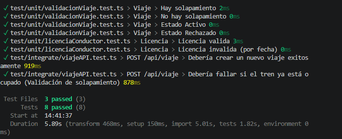

# Documentación del Proyecto - Mi Ferrocarril (BE-app)

Bienvenido a la documentación del backend del proyecto "Mi Ferrocarril". Aquí encontrará toda la información necesaria para entender, instalar y ejecutar la aplicación.

## Índice de Contenidos
- [Documentación del Proyecto - Mi Ferrocarril (BE-app)](#documentación-del-proyecto---mi-ferrocarril-be-app)
  - [Índice de Contenidos](#índice-de-contenidos)
  - [1. Proposal](#1-proposal)
  - [2. Introducción](#2-introducción)
    - [2.1 Tecnologías y dependencias](#21-tecnologías-y-dependencias)
      - [2.1.1 Core del backend](#211-core-del-backend)
      - [2.1.2 Base de datos y ORM](#212-base-de-datos-y-orm)
      - [2.1.3 Servidor y API](#213-servidor-y-api)
      - [2.1.4 Autenticación y seguridad](#214-autenticación-y-seguridad)
      - [2.1.5 Configuración y utilidades](#215-configuración-y-utilidades)
      - [2.1.6 Pruebas](#216-pruebas)
    - [2.2 Arquitectura](#22-arquitectura)
  - [3. Links a PR/MR y issues](#3-links-a-prmr-y-issues)
  - [4. Instrucciones de instalación](#4-instrucciones-de-instalación)
  - [4.1 Requisitos Previos](#41-requisitos-previos)
  - [4.2 Pasos de Instalación](#42-pasos-de-instalación)
      - [4.2.1 Clonar el Repositorio](#421-clonar-el-repositorio)
      - [4.2.2 Instalar Dependencias](#422-instalar-dependencias)
      - [4.2.3 Configurar la Base de Datos](#423-configurar-la-base-de-datos)
      - [4.2.4 Configurar Variables de Entorno](#424-configurar-variables-de-entorno)
    - [5. Compilar TypeScript](#5-compilar-typescript)
  - [4.3 Ejecución](#43-ejecución)
    - [4.3.1 Modo Desarrollo](#431-modo-desarrollo)
    - [4.3.2 Modo Producción](#432-modo-producción)
  - [4.4 Testing](#44-testing)
    - [4.4.1 Ejecutar todos los tests](#441-ejecutar-todos-los-tests)
    - [4.4.2 Ejecutar tests en modo watch](#442-ejecutar-tests-en-modo-watch)
    - [4.4.3 Ejecutar solo tests unitarios](#443-ejecutar-solo-tests-unitarios)
    - [4.4.4 Ejecutar solo tests de integración](#444-ejecutar-solo-tests-de-integración)
  - [4.5 Estructura de Directorios](#45-estructura-de-directorios)
  - [4.6 Solución de Problemas](#46-solución-de-problemas)
    - [Error de conexión a base de datos](#error-de-conexión-a-base-de-datos)
    - [Puertos ya en uso](#puertos-ya-en-uso)
    - [Problemas con dependencias](#problemas-con-dependencias)
  - [5. Documentación de la API](#5-documentación-de-la-api)
  - [5.1 Autenticacion](#51-autenticacion)
  - [5.2 Formato de Respuestas](#52-formato-de-respuestas)
    - [Respuesta Exitosa (2xx)](#respuesta-exitosa-2xx)
    - [Respuesta con Error (4xx, 5xx)](#respuesta-con-error-4xx-5xx)
  - [5.3 Endpoints (CRUD REST)](#53-endpoints-crud-rest)
    - [5.4 Recursos](#54-recursos)
  - [5.5 HTTP Status Codes](#55-http-status-codes)
  - [6. Evidencia de ejecución de tests automáticos](#6-evidencia-de-ejecución-de-tests-automáticos)
  - [6.1 Tests Unitarios](#61-tests-unitarios)
    - [6.1.1 Archivos de Test Disponibles](#611-archivos-de-test-disponibles)
    - [6.1.2 Ejecución de Tests Unitarios](#612-ejecución-de-tests-unitarios)
    - [6.1.3 Resultados](#613-resultados)
      - [Test: licenciaConductor.test.ts](#test-licenciaconductortestts)
      - [Test: validacionViaje.test.ts](#test-validacionviajetestts)
  - [6.2 Tests de Integración](#62-tests-de-integración)
    - [6.2.1 Archivos de Test Disponibles](#621-archivos-de-test-disponibles)
    - [6.2.2 Ejecución de Tests de Integración](#622-ejecución-de-tests-de-integración)
    - [6.2.3 Resultados](#623-resultados)
      - [Test: viajeAPI.test.ts](#test-viajeapitestts)
  - [6.3 Ejecución Completa de Tests](#63-ejecución-completa-de-tests)
    - [Comando](#comando)
    - [Evidencia del resultado](#evidencia-del-resultado)
  - [7. Tracking de features y bugs](#7-tracking-de-features-y-bugs)
  - [8. Deploy y Cloud](#8-deploy-y-cloud)
    - [8.1 Enlaces](#81-enlaces)
    - [8.2 Configuración de seguridad](#82-configuración-de-seguridad)
    - [8.3 Prueba de endpoints (Autenticación)](#83-prueba-de-endpoints-autenticación)
  - [9. Demo de app en video](#9-demo-de-app-en-video)

## 1. Proposal 
- Proposal: [proposal.md](https://github.com/santifnob/tp/blob/main/proposal.md)

## 2. Introducción

### 2.1 Tecnologías y dependencias

#### 2.1.1 Core del backend
- **Node.js** - entorno de ejecución que nos permite ejecutar el código JavaScript en el servidor.
- **pnpm** - gestor de paquete de datos para Node.js que utiliza almacenamiento compartido, altamente eficiente.
- **TypeScript** - lenguaje de programación superset de JavaScript con tipado estático.

#### 2.1.2 Base de datos y ORM
- **MySQL** - sistema de gestión de bases datos relacionales.
- **MikroORM** - ORM (Object-Relational Mapping) para interactuar con la base de datos MySQL, facilitando las operaciones CRUD.
- **@mikro-orm/mysql** - driver específico para MySQL en MikroORM.
- **reflect-metadata** - proporciona metadatos para decoradores, utilizado en el framework de MikroORM.

#### 2.1.3 Servidor y API
- **Express.js** - framework web para Node.js utilizado para crear el servidor API RESTful y manejar rutas HTTP.

#### 2.1.4 Autenticación y seguridad
- **jsonwebtoken** - librería para generar y verificar tokens JWT, utilizada en la autenticación de usuarios.
- **cookie-parser** - middleware para parsear cookies en las solicitudes HTTP.
- **cors** - middleware para habilitar Cross-Origin Resource Sharing, permitiendo solicitudes desde diferentes dominios.

#### 2.1.5 Configuración y utilidades
- **dotenv** - carga variables de entorno desde un archivo .env, usado para configuración segura.

#### 2.1.6 Pruebas
- **vitest** - framework de testing unitarios y de integración.
- **supertest** - permite simular peticiones HTTP a la API para el test integrado.
 
### 2.2 Arquitectura

El backend sigue el patrón de arquitectura MVC (Modelo-Vista-Controlador), donde los modelos representan las entidades de la base de datos, los controladores manejan la lógica de negocio y las vistas son las respuestas JSON de la API.

## 3. Links a PR/MR y issues
- Repositorio backend: https://github.com/santifnob/BE-app
- Pull requests / merge requests: https://github.com/santifnob/BE-app/pulls

## 4. Instrucciones de instalación

## 4.1 Requisitos Previos
- **Node.js**: v18.0.0 o superior
- **npm**: v8.0.0 o superior (o **pnpm**: v7.0.0 o superior)
- **MySQL**: v8.0 o superior
- **Git**: para clonar el repositorio

## 4.2 Pasos de Instalación

#### 4.2.1 Clonar el Repositorio

```bash
git clone <URL_DEL_REPOSITORIO>
cd BE-app
```

#### 4.2.2 Instalar Dependencias

Usando **pnpm** (recomendado):
```bash
pnpm install
```

O usando **npm**:
```bash
npm install

```

#### 4.2.3 Configurar la Base de Datos

  - ##### 4.2.3.1 Ejecutar el script FERROCARRIL_DB.sql para la creación de la base de datos y el usuario con permisos:

```bash
mysql -u root -p ferrocarril_db < docs/FERROCARRIL_DB.sql
```

  - ##### 4.2.3.2 (opcional) Ejecutar el script sample_data_dump.sql para la inserción de datos de ejemplo:

```bash
mysql -u root -p ferrocarril_db < docs/sample_data_dump.sql
```

#### 4.2.4 Configurar Variables de Entorno

En la raíz del proyecto crear los siguientes archivos

- `.env` (guiarse con .env.example):

```env
# Base de Datos
DB_HOST=localhost
DB_PORT=3306
DB_USER=admin
DB_PASSWORD=admin
DB_NAME=ferrocarril

# Servidor
PORT=3000
NODE_ENV=development
FRONTEND_URL=http://localhost:5173 # La URL del cliente que va a usar la API
ADMIN_EMAIL=        # Email para ingresar como admin
ADMIN_PASS=         # Contraseña de admin

# JWT
JWT_SECRET=tu_secreto_jwt_aqui
JWT_EXPIRES_IN=24h
```

- `.env.test` (guiarse con .env.test.example):
```env
NODE_ENV=test 
DB_NAME=ferrocarril_test
```

### 5. Compilar TypeScript

```bash
npm run build
```

## 4.3 Ejecución

### 4.3.1 Modo Desarrollo

Con reinicio automático en caso de cambios:

```bash
pnpm start:dev
```

El servidor estará disponible en `http://localhost:3000`

### 4.3.2 Modo Producción

```bash
npm start
```

## 4.4 Testing

### 4.4.1 Ejecutar todos los tests

```bash
pnpm test
```

### 4.4.2 Ejecutar tests en modo watch

```bash
pnpm test --watch
```

### 4.4.3 Ejecutar solo tests unitarios

```bash
pnpm test -- test/unit
```

### 4.4.4 Ejecutar solo tests de integración

```bash
pnpm test -- test/integrate
```

## 4.5 Estructura de Directorios

```
BE-app/
├── src/                          # Código fuente
│   ├── app.ts                   # Configuración principal
│   ├── analytics/               # Módulo de análisis
│   ├── carga/                   # Gestión de cargas
│   ├── categoriaDenuncia/       # Categorías de denuncias
│   ├── conductor/               # Gestión de conductores
│   ├── estadoTren/              # Estados de trenes
│   ├── licencia/                # Gestión de licencias
│   ├── lineaCarga/              # Líneas de carga
│   ├── middlewares/             # Middleware de autenticación
│   ├── observacion/             # Observaciones de viajes
│   ├── recorrido/               # Gestión de recorridos
│   ├── shared/                  # Código compartido
│   ├── tipoCarga/               # Tipos de carga
│   ├── tren/                    # Gestión de trenes
│   └── viaje/                   # Gestión de viajes
├── test/                        # Tests
│   ├── unit/                    # Tests unitarios
│   └── integrate/               # Tests de integración
├── docs/                        # Documentación
├── dist/                        # Código compilado (generado)
├── package.json                 # Dependencias
└── tsconfig.json                # Configuración TypeScript
└── .env.example                 # Ejemplo de .env
└── .env.test.example            # Ejemplo de .env.test
└── .nvmrc                       # Versión utilizada de Node.js
└── .vitest.setup.ts             # Setup para los test con vitest
└── .vitest.config.ts            # Configuración para los test con vitest
```

## 4.6 Solución de Problemas

### Error de conexión a base de datos

1. Verificar que MySQL esté corriendo
2. Confirmar credenciales en `.env`
3. Verificar que la base de datos existe: 
   ```bash
   mysql -u root -p -e "SHOW DATABASES;"
   ```

### Puertos ya en uso

Si el puerto 3000 está ocupado, cambiar en `.env`:
```env
PORT=3001
```

### Problemas con dependencias

Limpiar e reinstalar:
```bash
rm -rf node_modules pnpm-lock.yaml
pnpm install
```

## 5. Documentación de la API

## 5.1 Autenticacion
Todos los endpoints protegidos requieren un token JWT en el header:

```
Authorization: Bearer <token_jwt>
```

El middleware que se encarga de realizar el control de la autenticación es authenticateToken. Se utiliza en el endpoint:
- `GET api/auth/check` - Verificación rapida el token

En producción, el middleware authenticateToken además se utiliza en endpoints sensibles, junto al middleware de authenticateRole (verificación de nivel de acceso admin) y allowReadRestrictWrite (permitir lectura a conductores).

## 5.2 Formato de Respuestas

### Respuesta Exitosa (2xx)

```json
{
  "data": {
    "id": 1,
    "campo": "valor"
  },
  "message": "Operación exitosa"
}
```

### Respuesta con Error (4xx, 5xx)

```json
{
  "error": "Descripción del error",
  "message": "Mensaje para mostrar"
}
```

## 5.3 Endpoints (CRUD REST)

Todos los recursos soportan las operaciones estándar REST:
- `GET api/<recurso>` - Listar (con parámetros de consulta `page` y `limit`)
- `GET api/<recurso>/:id` - Obtener uno
- `POST api/<recurso>` - Crear
- `PUT api/<recurso>/:id` - Actualizar
- `DELETE api/<recurso>/:id` - Eliminar

### 5.4 Recursos
- `/tren` - Trenes
- `/conductor` - Conductores
- `/viaje` - Viajes
- `/carga` - Cargas
- `/licencia` - Licencias
- `/recorrido` - Recorrido
- `/estadoTren` - Estados de tren
- `/tipoCarga` - Tipo de cargas 
- `/categoriaDenuncia` - Categoria denuncia
- `/observacion` - Observaciones
- `/lineaCarga` - Linea carga
- `/analytics` - Analiticas para Widgets

## 5.5 HTTP Status Codes

| Codigo | Descripcion |
|------|---------|
| 200 | OK |
| 201 | Created |
| 400 | Bad Request |
| 401 | Unauthorized |
| 404 | Not Found |
| 500 | Server Error |

## 6. Evidencia de ejecución de tests automáticos

## 6.1 Tests Unitarios

### 6.1.1 Archivos de Test Disponibles

- `test/unit/licenciaConductor.test.ts` - Tests para funcionalidad de licencias
- `test/unit/validacionViaje.test.ts` - Tests para validaciones de viajes

### 6.1.2 Ejecución de Tests Unitarios

Para ejecutar los tests unitarios:

```bash
pnpm test -- test/unit
```

### 6.1.3 Resultados

#### Test: licenciaConductor.test.ts

**Descripción**: Valida el comportamiento del módulo de licencias de conductores.

**Casos de Prueba**:
- [ ] Validar creación de licencia válida
- [ ] Validar caso de licencia invalida


#### Test: validacionViaje.test.ts

**Descripción**: Valida las reglas de negocio para viajes.

**Casos de Prueba**:
- [ ] Validar caso de solapamiento
- [ ] Validar caso de no solapamiento
- [ ] Validar estado activo de viaje
- [ ] Validar estado rechazado de viaje
  
## 6.2 Tests de Integración

### 6.2.1 Archivos de Test Disponibles

- `test/integrate/viajeAPI.test.ts` - Tests de integración para API de viajes

### 6.2.2 Ejecución de Tests de Integración

Para ejecutar los tests de integración:

```bash
pnpm test -- test/integrate
```

### 6.2.3 Resultados

#### Test: viajeAPI.test.ts

**Descripción**: Prueba la integración completa de los endpoints de viajes.

**Endpoint Testeado**:
- [ ] POST /api/viaje - Crear viaje

## 6.3 Ejecución Completa de Tests

### Comando

```bash
pnpm test
```

### Evidencia del resultado



---

## 7. Tracking de features

## 8. Deploy y Cloud

El sistema se encuentra productivo en **DigitalOcean**, utilizando una arquitectura de servicios gestionados:

- **Backend API:** Alojado en **DigitalOcean App Platform** (Node.js Environment).
- **Base de Datos:** **MySQL Managed Cluster**, garantizando persistencia y backups.
- **Seguridad:** Conexión cifrada vía SSL y gestión de variables de entorno para datos sensibles.

### 8.1 Enlaces
- **API URL:** [https://api.miferrocarril.app](https://api.miferrocarril.app)
- **Estado del servicio:** Activo

### 8.2 Configuración de seguridad
El acceso a la base de datos gestionada en DigitalOcean se realiza mediante variables de entorno configuradas en el App Platform. Esto evita el hard-coding de credenciales sensibles en el código fuente.

- **Host**: db-ferrocarril-do-user-36920907-0.i.db.ondigitalocean.com

- **Puerto**: 25060

- **SSL**: Requerido (CA Certificate).

### 8.3 Prueba de endpoints (Autenticación)
La mayoría de las rutas están protegidas por JWT. Para testear la API de forma aislada, se debe realizar una petición POST a /api/auth/login con las siguientes credenciales para obtener el token de acceso:

- **Email**: admin@admin.com

- **Password**: admin (acá podés poner "ver sección de acceso en Frontend" o ponerla directamente).

## 9. Demo de app en video
- Puedes ver el video demostrativo del proyecto:
[](https://www.youtube.com/watch?v=_CfoCqo7NYQ)
